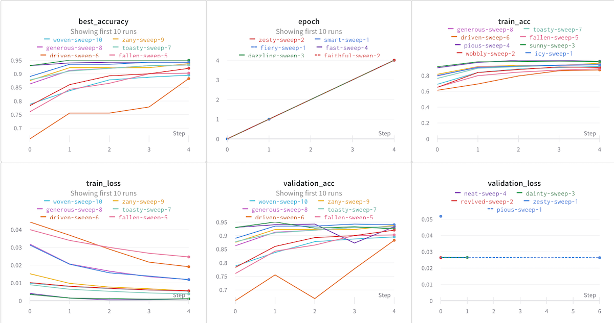
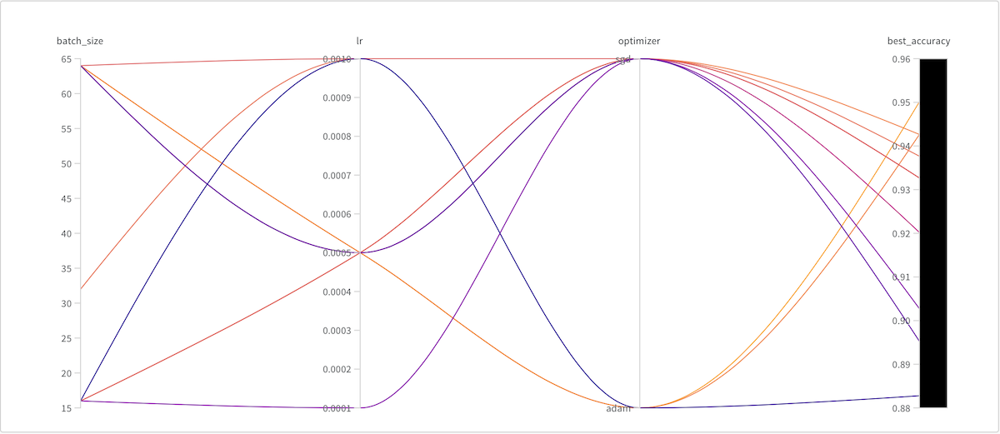
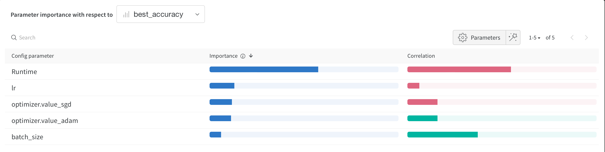
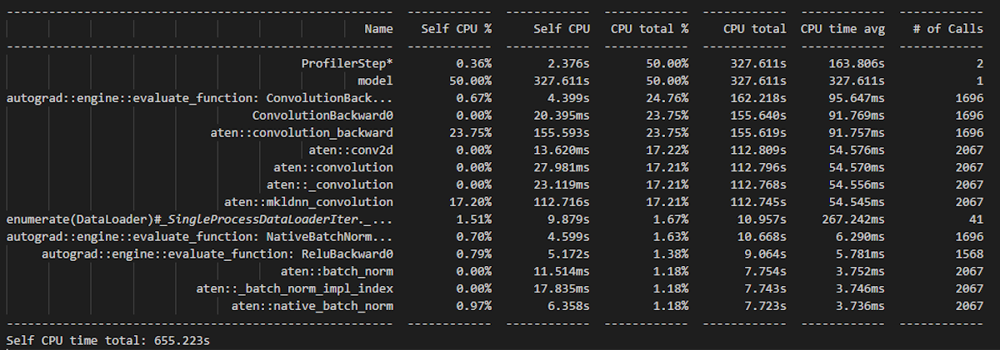
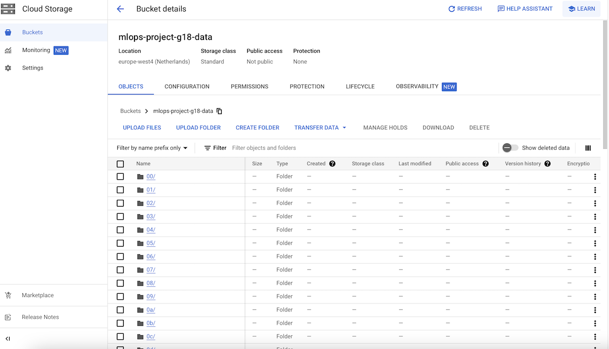
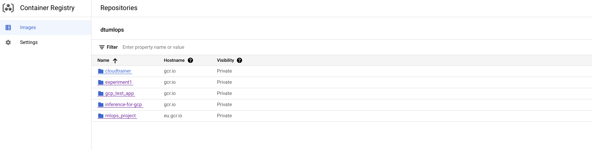
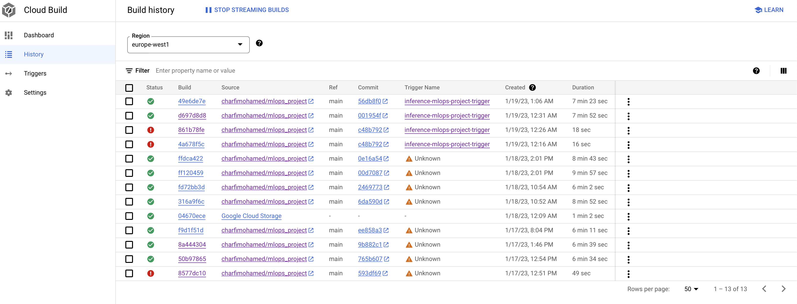
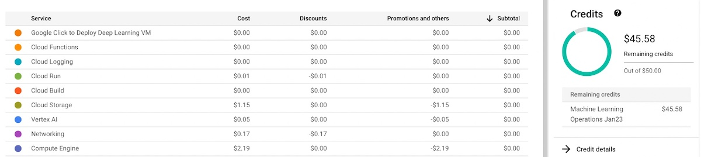
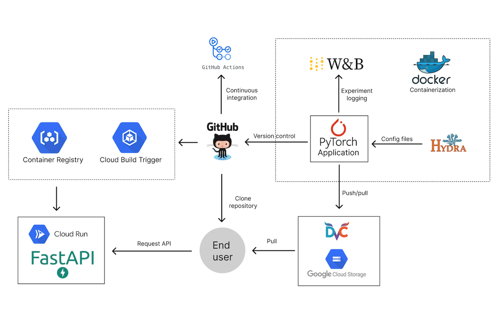

# Exam template for 02476 Machine Learning Operations

This is the report template for the exam. Please only remove the text formatted as with three dashes in front and behind
like:

```--- question 1 fill here ---```

where you instead should add your answers. Any other changes may have unwanted consequences when your report is auto
generated in the end of the course. For questions where you are asked to include images, start by adding the image to
the `figures` subfolder (please only use `.png`, `.jpg` or `.jpeg`) and then add the following code in your answer:

```markdown

```

In addition to this markdown file, we also provide the `report.py` script that provides two utility functions:

Running:

```bash
python report.py html
```

will generate an `.html` page of your report. After deadline for answering this template, we will autoscrape
everything in this `reports` folder and then use this utility to generate an `.html` page that will be your serve
as your final handin.

Running

```bash
python report.py check
```

will check your answers in this template against the constrains listed for each question e.g. is your answer too
short, too long, have you included an image when asked to.

For both functions to work it is important that you do not rename anything. The script have two dependencies that can
be installed with `pip install click markdown`.

## Overall project checklist

The checklist is *exhaustic* which means that it includes everything that you could possible do on the project in
relation the curricilum in this course. Therefore, we do not expect at all that you have checked of all boxes at the
end of the project.

### Week 1

* [x] Create a git repository
* [x] Make sure that all team members have write access to the github repository
* [x] Create a dedicated environment for you project to keep track of your packages
* [x] Create the initial file structure using cookiecutter
* [x] Fill out the `make_dataset.py` file such that it downloads whatever data you need and
* [x] Add a model file and a training script and get that running
* [x] Remember to fill out the `requirements.txt` file with whatever dependencies that you are using
* [x] Remember to comply with good coding practices (`pep8`) while doing the project
* [x] Do a bit of code typing and remember to document essential parts of your code
* [x] Setup version control for your data or part of your data
* [x] Construct one or multiple docker files for your code
* [x] Build the docker files locally and make sure they work as intended
* [x] Write one or multiple configurations files for your experiments
* [x] Used Hydra to load the configurations and manage your hyperparameters
* [x] When you have something that works somewhat, remember at some point to to some profiling and see if
      you can optimize your code
* [x] Use Weights & Biases to log training progress and other important metrics/artifacts in your code. Additionally,
      consider running a hyperparameter optimization sweep.
* [ ] Use Pytorch-lightning (if applicable) to reduce the amount of boilerplate in your code

### Week 2

* [x] Write unit tests related to the data part of your code
* [x] Write unit tests related to model construction and or model training
* [x] Calculate the coverage.
* [x] Get some continuous integration running on the github repository
* [x] Create a data storage in GCP Bucket for you data and preferable link this with your data version control setup
* [x] Create a trigger workflow for automatically building your docker images
* [x] Get your model training in GCP using either the Engine or Vertex AI
* [x] Create a FastAPI application that can do inference using your model
* [ ] If applicable, consider deploying the model locally using torchserve
* [x] Deploy your model in GCP using either Functions or Run as the backend

### Week 3

* [ ] Check how robust your model is towards data drifting
* [x] Setup monitoring for the system telemetry of your deployed model
* [ ] Setup monitoring for the performance of your deployed model
* [ ] If applicable, play around with distributed data loading
* [ ] If applicable, play around with distributed model training
* [x] Play around with quantization, compilation and pruning for you trained models to increase inference speed

### Additional

* [x] Revisit your initial project description. Did the project turn out as you wanted?
* [x] Make sure all group members have a understanding about all parts of the project
* [x] Uploaded all your code to github

## Group information

### Question 1
> **Enter the group number you signed up on <learn.inside.dtu.dk>**
>
> Answer:

Awesome 18

### Question 2
> **Enter the study number for each member in the group**
>
> Example:
>
> *sXXXXXX, sXXXXXX, sXXXXXX*
>
> Answer:

s174447, s221586, s221551

### Question 3
> **What framework did you choose to work with and did it help you complete the project?**
>
> Answer length: 100-200 words.
>
> Example:
> *We used the third-party framework ... in our project. We used functionality ... and functionality ... from the*
> *package to do ... and ... in our project*.
>
> Answer:

Initially, we were planning to use the PyTorch Image Models framework and to use the pre-trained Inception ResNet v2 model and fine tune it in order to do classification of cats and dogs. However, changing the model architecture was so hard and training the model took much more time than what we expected. Upon consulting with the TAs and Nicki, we switched to the Torchvision framework. We have used the built in pre trained Torchvision resnet50 model. In order for it to work with the binary classification task in our project, we have changed the last fully connected layer to output only two features.  

## Coding environment

> In the following section we are interested in learning more about you local development environment.

### Question 4

> **Explain how you managed dependencies in your project? Explain the process a new team member would have to go**
> **through to get an exact copy of your environment.**
>
> Answer length: 100-200 words
>
> Example:
> *We used ... for managing our dependencies. The list of dependencies was auto-generated using ... . To get a*
> *complete copy of our development enviroment, one would have to run the following commands*
>
> Answer:

We have used `conda` to create the local python environment and made use of `pip` and the `requirements.txt` file for installing and tracking the dependencies. In order to create the list of dependencies we used the `pipreqs` package to automatically scan our project dependencies. To get a complete copy of our development environment, one should:  


1. Clone the repo:  
```
git clone https://github.com/charfimohamed/mlops_project  
cd mlops_project  
```
2. Create a new `conda` environment:  
```
conda create -n mlops_project python=3.9  
conda activate mlops_project  
```
3. Install the dependencies  
```
pip install -r requirements.txt  
```
4. Either set up [Kaggle API](https://adityashrm21.github.io/Setting-Up-Kaggle/) on their local machine and run `make data` (or use the keys present in the .env file : in this case directly run make data)  
or   
```
dvc pull  
```


### Question 5

> **We expect that you initialized your project using the cookiecutter template. Explain the overall structure of your**
> **code. Did you fill out every folder or only a subset?**
>
> Answer length: 100-200 words
>
> Example:
> *From the cookiecutter template we have filled out the ... , ... and ... folder. We have removed the ... folder*
> *because we did not use any ... in our project. We have added an ... folder that contains ... for running our*
> *experiments.*
> Answer:

We initialized our project using the cookiecutter template and tried to follow their proposed structure. Inside `data/` folder we have stored our downloaded dataset,  in `notebooks/` we have an initial data exploration jupyter notebook, `src/` (and its subfolders) contains all of our source code, including scripts to download data, model definition,training, optimisation and prediction scripts. In addition to the cookiecutter template, we added a `tests/` folder that contains all of our tests, an `app/` folder that contains our FastAPI implementation and a checkpoints folder in `src/models` that contains our model best weights. Additionally, we also have `.dvc/` and `.github` folders for storing dvc configuration and GitHub workflows. We added dockerfiles and some configuration files (`.env`,`cloudbuild.yaml`,...).
We opted not to delete the `docs/`, `models/` and `references/` folders.


### Question 6

> **Did you implement any rules for code quality and format? Additionally, explain with your own words why these**
> **concepts matters in larger projects.**
>
> Answer length: 50-100 words.
>
> Answer:

We try to adhere to the PEP8 standard and have used `flake8` to check for compliance. `black` was our choice for automatic code formatting and we have used `isort` in order to organize the import statements in our code. Adhering to specific formatting rules, even if they are subjectively defined, is important when working in larger projects with more than one contributor because it sets a standard for the project and keeps the coding style consistent. It allows existing and new contributors to more efficiently contribute and cooperate on the codebase.  

## Version control

> In the following section we are interested in how version control was used in your project during development to
> corporate and increase the quality of your code.

### Question 7

> **How many tests did you implement and what are they testing in your code?**
>
> Answer length: 50-100 words.
>
> Example:
> *In total we have implemented X tests. Primarily we are testing ... and ... as these the most critical parts of our*
> *application but also ... .*
>
> Answer:

In total we have implemented 12 tests.  
For the data part if the data files are found, we test the training, validation and testing dataset sizes, whether all of the labels are present and if the image transforms work as expected.  
For the model we are testing whether the model outputs the correct shape if it is given a random batch of images and whether an invalid input (3D tensor for example) raises an error.  
For the training script we are testing if saving the model works as expected and if the accuracy is better than baseline.  

### Question 8

> **What is the total code coverage (in percentage) of your code? If you code had an code coverage of 100% (or close**
> **to), would you still trust it to be error free? Explain you reasoning.**
>
> Answer length: 100-200 words.
>
> Example:
> *The total code coverage of code is X%, which includes all our source code. We are far from 100% coverage of our **
> *code and even if we were then...*
>
> Answer:

The code coverage for this project is 88%, as shown in the table below. However, it's worth noting that this high coverage does not guarantee that the code is free of errors. One file, `make_dataset.py`, was not fully covered, specifically the sections dealing with Kaggle API authentication and data download, as well as the main function. It's important to keep in mind that even with a high code coverage, it's possible that not all edge cases have been tested. Therefore, it's important to thoroughly review and test the code to ensure it's functioning correctly.
`Name----------------------|_Stmts_|_Miss_|_Cover`  
`--------------------------|-------|------|-------`  
`src/__init__.py-----------|-0-----|----0-|--100%`  
`src/data/__init__.py------|-0-----|----0-|--100%`  
`src/data/make_dataset.py--|-101---|----25|--75%`  
`src/models/__init__.py----|-0-----|----0-|--100%`  
`src/models/model.py-------|-14----|----0-|--100%`  
`tests/__init__.py---------|-4-----|----0-|--100%`  
`tests/test_data.py--------|-48----|----0-|--100%`  
`tests/test_model.py-------|-15----|----0-|--100%`  
`tests/test_training.py----|-19----|----0-|--100%`  
`TOTAL---------------------|-201---|----25|--88%`  


### Question 9

> **Did you workflow include using branches and pull requests? If yes, explain how. If not, explain how branches and**
> **pull request can help improve version control.**
>
> Answer length: 100-200 words.
>
> Example:
> *We made use of both branches and PRs in our project. In our group, each member had an branch that they worked on in*
> *addition to the main branch. To merge code we ...*
>
> Answer:

Our workflow did include the use of branches and pull requests. Early in the project we made use of branches. Each member worked on a separate branch for every bigger feature in the project. This allowed us to make use of pull requests and review the code before it was merged into the main branch. Additionally, it made it much easier to resolve merge conflicts and work remotely. However, when a change was minor and all members were aware of it, we sometimes skipped the process of creating a new branch and making a pull request and pushed the code directly to the main branch.  


### Question 10

> **Did you use DVC for managing data in your project? If yes, then how did it improve your project to have version**
> **control of your data. If no, explain a case where it would be beneficial to have version control of your data.**
>
> Answer length: 100-200 words.
>
> Example:
> *We did make use of DVC in the following way: ... . In the end it helped us in ... for controlling ... part of our*
> *pipeline*
>
> Answer:

Our dataset was on the smaller side (less than 3000 images) and we had a data pipeline that would download the raw data from Kaggle if it was not already present. Therefore, having data version control and the ability to pull data was not strictly necessary in our case. Despite that, we have still used DVC for managing the data. In our project, it would be beneficial in the case where the dataset in Kaggle would change or would be made private. Additionally, it makes it easier for other users to clone the project and get the data because they won't have to set up Kaggle API keys on their local machines(if we decide to delete the kaggle key and username from the .env file).  

### Question 11

> **Discuss you continues integration setup. What kind of CI are you running (unittesting, linting, etc.)? Do you test**
> **multiple operating systems, python version etc. Do you make use of caching? Feel free to insert a link to one of**
> **your github actions workflow.**
>
> Answer length: 200-300 words.
>
> Example:
> *We have organized our CI into 3 separate files: one for doing ..., one for running ... testing and one for running*
> *... . In particular for our ..., we used ... .An example of a triggered workflow can be seen here: <weblink>*
>
> Answer:

Our continuous integration setup consists of using unit testing and Git actions, which is the CI solution that Github provides.  
For unit testing we test the data, training and the model: We have conducted 12 tests in total, which include checking the size of the train, validation, and test datasets, ensuring all labels are present, and verifying that the image transforms function properly. Additionally, we have tested the model output shape and handling of invalid input, as well as the functionality of saving the model and the improvement of accuracy compared to the baseline.  
And for the Github solution we created 3 files: flake8.yml, isort.yml and tests.yml which, each, includes code that enables us to check and install all the dependencies that are included in the requirements.txt and requirements_tests.txt files if they are not already installed, compute our pytest, isort and flake tests each time we pull or push our code from certain branches.  
We made use of caching in all of the git actions workflow files which avoids github from destroying every downloaded package when the workflow has been executed which will save us time on the next executions.
We tested different operating systems (Linux(Ubuntu), Windows, macOs) and different python ("3.8", "3.9", "3.10") and pytorch versions ("1.11.0", "1.12.0").  
An example of a triggered workflow can be seen here:  
https://github.com/charfimohamed/mlops_project/actions/runs/3953847408  


## Running code and tracking experiments

> In the following section we are interested in learning more about the experimental setup for running your code and
> especially the reproducibility of your experiments.

### Question 12

> **How did you configure experiments? Did you make use of config files? Explain with coding examples of how you would**
> **run a experiment.**
>
> Answer length: 50-100 words.
>
> Example:
> *We used a simple argparser, that worked in the following way: python my_script.py --lr 1e-3 --batch_size 25*
>
> Answer:

We used the Hydra configuration tool. We created a simple yaml configuration file containing different values that our hyperparameters can take and within the training python file we extracted random values from the config file and used them to run a hyperparameter optimization sweep using WandB. We displayed the accuracy results after doing 10 experiments with different configurations on our weightsandBiases accounts and we found the best values of our parameters that maximize the validation accuracy.  
As a coding example, we created a configuration file: config.yaml.  
For running the experiment, we run python optimize_train_model.py.  


### Question 13

> **Reproducibility of experiments are important. Related to the last question, how did you secure that no information**
> **is lost when running experiments and that your experiments are reproducible?**
>
> Answer length: 100-200 words.
>
> Example:
> *We made use of config files. Whenever an experiment is run the following happens: ... . To reproduce an experiment*
> *one would have to do ...*
>
> Answer:

We used config files. Instead of directly putting the experiment configuration parameters into our training python file, we use configuration files and whenever we need a specific configuration we just call the specific config file and extract its hyperparameters. We did not see the need behind having multiple configuration files since each of our hyperparameters contains a list of values and one of them is used randomly in every experiment.  
To reproduce an experiment one can open the `outputs` file written by Hydra and check for the subfolder with the time that specific experiment was executed and read the values of the parameters in one of its subfolders. We can also note that the config files parameters are saved by WandB during training, ensuring that the hyperparameters for a specific experiment are not accidentally overwritten and lost.  


### Question 14

> **Upload 1 to 3 screenshots that show the experiments that you have done in W&B (or another experiment tracking**
> **service of your choice). This may include loss graphs, logged images, hyperparameter sweeps etc. You can take**
> **inspiration from [this figure](figures/wandb.png). Explain what metrics you are tracking and why they are**
> **important.**
>
> Answer length: 200-300 words + 1 to 3 screenshots.
>
> Example:
> *As seen in the first image when have tracked ... and ... which both inform us about ... in our experiments.*
> *As seen in the second image we are also tracking ... and ...*
>
> Answer:

Talking about the experiments that we did with WandB, we started by applying the wandb.init and wandb.log methods that enable us to initialize the weights and biases and log some parameters according to which we trace performance and then we created and run a hyperparameter sweep using the configuration parameters from the config file. We defined our goal to maximize the best accuracy, in other words,the best validation accuracy among all the epochs which will hopefully enable us to find the best test accuracy when testing our model afterwards.  
  
  
  
The first image: shows 6 graphs where each presents the different values of one of the metrics (validation_acc, epoch, train_acc, train_loss, validatipon_loss, best_accuracy) with respect to each sweep configuration parameters and the number of steps and the second image:  shows all the hyperparameter configurations for each sweep (lr, optimizer, batch_size) on the same graph and the impact of each combination of hyperparameters from each sweep on the final best_accuracy value which enables us to deduce the best combination of hyperparameters to obtain the optimal validation accuracy. The third image tells us which hyperparameter is the most important with respect to the best validation accuracy and it turns out to be the learning rate followed by the optimizer with its two different values ("sgd", "adam").  


### Question 15

> **Docker is an important tool for creating containerized applications. Explain how you used docker in your**
> **experiments? Include how you would run your docker images and include a link to one of your docker files.**
>
> Answer length: 100-200 words.
>
> Example:
> *For our project we developed several images: one for training, inference and deployment. For example to run the*
> *training docker image: `docker run trainer:latest lr=1e-3 batch_size=64`. Link to docker file: <weblink>*
>
> Answer:

For our project we created multiple images :  
- trainer.dockerfile for training the model (getting the best model weights)  
- predict.dockerfile for testing the model(loading the model weights and calculating the model accuracy on never seen data (testing data))  
- inference.dockerfile for deploying the model (using fast api))  
For example, to build the docker image of the inference.dockerfile we navigate to the project directory and run the command :  
docker build -f inference.dockerfile . -t my_fastapi_app  
and to run the image we need to run the command :  
docker run --name mycontainer -p 80:80 my_fastapi_app after that we can go to the url:  
http://localhost:8000/docs where we can upload an image and see how our model classifies the image (cat or dog)  
Link to the inference dockerfile: https://github.com/charfimohamed/mlops_project/blob/main/inference.dockerfile  


### Question 16

> **When running into bugs while trying to run your experiments, how did you perform debugging? Additionally, did you**
> **try to profile your code or do you think it is already perfect?**
>
> Answer length: 100-200 words.
>
> Example:
> *Debugging method was dependent on group member. Some just used ... and others used ... . We did a single profiling*
> *run of our main code at some point that showed ...*
>
> Answer:

Initial debugging was done using print statements. We implemented profiling by using the PyTorch Profiler to profile the CPU/CUDA activities during the training of the model. The "with profile" statement is creating a context in which the profiler will collect data. The schedule argument is used to set the timing of the profiler collection of data. In this case, it is set to wait for 0 seconds, warm-up for 0 seconds, and then actively collect data for 10 seconds.  
The profiler step function is called inside the for-loop for training the model, this will start collecting the data for CPU and CUDA activities for each step of the training and the data can be analyzed to understand the performance of the model during training. Then we print out a table of key averages of the collected data, sorted by "cpu_time_total". This table is used to understand which functions are taking the most time during the training. And as shown in the table below the code does not need any specific optimization since the model uses 50% of the total CPU time, which is quite enough.  





## Working in the cloud

> In the following section we would like to know more about your experience when developing in the cloud.

### Question 17

> **List all the GCP services that you made use of in your project and shortly explain what each service does?**
>
> Answer length: 50-200 words.
>
> Example:
> *We used the following two services: Engine and Bucket. Engine is used for... and Bucket is used for...*
>
> Answer:

In our project we made use of these services:  
- compute engine : we tried to use the compute engine to train our model in a virtual machine but we finally trained our model locally since it takes 20 minutes to be trained  
- cloud storage : we used the cloud storage in GCP to store our data in the google cloud bucket using dvc 
-cloud build : we used the cloud build to build docker images on the cloud whenever we push in the main github branch  
-Vertex AI : we trained our model using a custom job after configuring the cloudtrainer image in the cloud that trains the model but we did not manage to extract the model checkpoint from the cloud.  
-Cloud run : we created a service that pulls the data from our git repository,builds an image using cloudbuild.yaml for inference so that whenever someone pushes in the main branch, the image rebuilds and the inference API changes. With this tool the FastAPI is always running on the cloud and updated everytime we push.  
-Monitoring : we used Monitoring to get email alerts whenever the inference image is being revisited.  


### Question 18

> **The backbone of GCP is the Compute engine. Explained how you made use of this service and what type of VMs**
> **you used?**
>
> Answer length: 100-200 words.
>
> Example:
> *We used the compute engine to run our ... . We used instances with the following hardware: ... and we started the*
> *using a custom container: ...*
>
> Answer:

We used the compute engine to create a virtual machine instance starting from the deep learning platform release image. We accessed the VM terminal using:  
 `gloud compute ssh --zone "europe-west1-b" "mlops-project-g18-instance" --project "dtumlops-374918"`  
then we cloned our git repository, installed the dependencies using:  
`pip install -r requirements.txt` ,  
pulled the data by either using the command `make data` or by pulling the data using dvc from the cloud and finally ran the `train_model.py`. With this we trained our model in a virtual machine.  
We used an instance with the following configuration:  
machine type : `n1-standard-1`  
Cpu platform : `intel haswell`  
GPUs : `None`  
Zone : `europe-west1-b`  


### Question 19

> **Insert 1-2 images of your GCP bucket, such that we can see what data you have stored in it.**
> **You can take inspiration from [this figure](figures/bucket.png).**
>
> Answer:

We stored our training , validation and testing data in this bucket :  
  
  


### Question 20

> **Upload one image of your GCP container registry, such that we can see the different images that you have stored.**
> **You can take inspiration from [this figure](figures/registry.png).**
>
> Answer:

GCP container registry:  
  



### Question 21

> **Upload one image of your GCP cloud build history, so we can see the history of the images that have been build in**
> **your project. You can take inspiration from [this figure](figures/build.png).**
>
> Answer:

GCP cloud build history:  
  
  


### Question 22

> **Did you manage to deploy your model, either in locally or cloud? If not, describe why. If yes, describe how and**
> **preferably how you invoke your deployed service?**
>
> Answer length: 100-200 words.
>
> Example:
> *For deployment we wrapped our model into application using ... . We first tried locally serving the model, which*
> *worked. Afterwards we deployed it in the cloud, using ... . To invoke the service an user would call*
> *`curl -X POST -F "file=@file.json"<weburl>`*
>
> Answer:

For deployment we played around with local deployment and cloud deployment:  
- Local deployment: we created a docker image with the inference.dockerfile dockerfile that copies the src code and runs uvicorn on the main.py that contains the fastAPI configuration.(we use `docker build -f inference.dockerfile . -t my_fastapi_app`). When running the docker file with `docker run --name mycontainer -p 80:80 my_fastapi_app` we can access this url : http://localhost:8000/docs , upload the file and read the response to get what the deployed model predicts.  
The same procedure can be done without a docker image by running this command:  
`uvicorn --reload --port 8000 main:app` and accessing the same URL as above  
- Cloud deployment : for the cloud deployment we created a Cloud Run service that ,whenever we push in the main github branch, creates/updates the docker image and deploys the API: with that we can now access this URL from any device with this URL : https://inference-for-gcp-sjsexi6d7a-ew.a.run.app/docs 
One can also access the API using a curl command :  
`curl -X POST -H "Content-Type: multipart/form-data" -F "data=@imagepath/image.png" https://inference-for-gcp-sjsexi6d7a-ew.a.run.app/cv_model/`  
Where `imagepath/image.png` is the path to the Cat or dog image you want to classify  


### Question 23

> **Did you manage to implement monitoring of your deployed model? If yes, explain how it works. If not, explain how**
> **monitoring would help the longevity of your application.**
>
> Answer length: 100-200 words.
>
> Example:
> *We did not manage to implement monitoring. We would like to have monitoring implemented such that over time we could*
> *measure ... and ... that would inform us about this ... behaviour of our application.*
>
> Answer:

We determined that implementing data drifting is unnecessary as our deployed model is reliable and will continue to function correctly over time without any intervention. Furthermore, the data we are working with, consisting of images of cats and dogs, will not change or drift over time as the characteristics of a cat or dog image will remain the same. As a result, we can confidently perform inference on new data that will not deviate from the distribution of the data our model was trained on.  
Despite that, we managed to implement some system monitoring with google cloud monitoring alerts so that everytime a new git push is made a new docker image is built and an alert is triggered so that we get an email saying that a new revision has been made.  


### Question 24

> **How many credits did you end up using during the project and what service was most expensive?**
>
> Answer length: 25-100 words.
>
> Example:
> *Group member 1 used ..., Group member 2 used ..., in total ... credits was spend during development. The service*
> *costing the most was ... due to ...*
>
> Answer:

Mohamed used approximately 4 credits, Aziz used approximately 14 credits(mainly wasted on using the cloud instances).  
For mohamed The service costing the most was cloud engine with 2 credits  
  

## Overall discussion of project

> In the following section we would like you to think about the general structure of your project.

### Question 25

> **Include a figure that describes the overall architecture of your system and what services that you make use of.**
> **You can take inspiration from [this figure](figures/overview.png). Additionally in your own words, explain the**
> **overall steps in figure.**
>
> Answer length: 200-400 words
>
> Example:
>
> *The starting point of the diagram is our local setup, where we integrated ... and ... and ... into our code.*
> *Whenever we commit code and puch to github, it auto triggers ... and ... . From there the diagram shows ...*
>
> Answer:

The overall project structure follows the cookiecutter template. The python environment is managed using conda and the requirements using pip. The PyTorch cat and dog classification uses torchvision resnet50 model. Configuration files are managed using Hydra and the experiment logging is done with Weights and Biases and the containerization is done using Docker.  
The dataset is downloaded from Kaggle and pushed to a remote Google Cloud Platform bucket using dvc. Version control is done using git and stored remotely on GitHub.  
Continuous integration is set up through GitHub actions, checks the style of the code and runs the unit tests. Whenever code is pushed to the main branch, Cloud Build Trigger is used to build docker images on the cloud: everytime we push, a docker image corresponding to the inference.dockerfile is created and stored.  
Cloud run is used to create a service that pulls the data from our git repository, builds an image using cloudbuild.yaml for inference so that whenever someone pushes in the main branch, the image rebuilds and the inference API changes. With this tool the FastAPI is always running on the cloud.  
The end user can then query the API through a FastAPI website or a curl command.  
The end user can as well clone the whole codebase from GitHub and pull the data using dvc from Google Cloud bucket.  



### Question 26

> **Discuss the overall struggles of the project. Where did you spend most time and what did you do to overcome these**
> **challenges?**
>
> Answer length: 200-400 words.
>
> Example:
> *The biggest challenges in the project was using ... tool to do ... . The reason for this was ...*
>
> Answer:

Here is a list of the struggles that we mainly faced during the project:  
- Choosing the right model to work with was a big challenge for us:  
Initially, our plan was to utilize the PyTorch Image Models framework and a pre-trained Inception ResNet v2 model for classifying cats and dogs. However, we encountered difficulties modifying the model architecture and training the model took longer than expected. After seeking guidance from the TAs and Nicki, we decided to switch to the Torchvision framework and use the pre-trained resnet50 model to which we changed the final layer to adapt the model for our binary classification task.  
- Deployment: Once a model is trained and tuned, deploying the model was a challenge for us since we have never worked with GCP and the exercises were a little bit different from what we wanted to deploy.  
- The fact that we handle a lot of new daily content was overwhelming at some point.  
- Another issue we faced was that some members of our group using macOS had an easier time with dependency installations compared to those using Windows, who experienced difficulty and had to spend some time debugging and resolving issues on their machines.  
- We also struggled with maintaining a working github and trying to work on different branches and committing and merging code correctly and the fewer times possible to avoid code loss.  
   => To tackle most of these challenges, we divided the tasks to be done from the start and allocated extra time to stay current and received significant support from Nicki in debugging and resolving issues.  


### Question 27

> **State the individual contributions of each team member. This is required information from DTU, because we need to**
> **make sure all members contributed actively to the project**
>
> Answer length: 50-200 words.
>
> Example:
> *Student sXXXXXX was in charge of developing of setting up the initial cookie cutter project and developing of the*
> *docker containers for training our applications.*
> *Student sXXXXXX was in charge of training our models in the cloud and deploying them afterwards.*
> *All members contributed to code by...*
>
> Answer:

All members contributed to code by complying with good coding practices, filling in `requirements.txt` file, doing code typing and documentation.  
- Nojus(s174447) was mainly responsible for the data pipeline: set up a Kaggle API, did the initial data exploration, created the data loader and transformations, wrote data unit tests, set up Google Cloud bucket and data version control.  
- Aziz(s221551) contributed by adding the TIMM version of model/training python files, setting data on Google Drive, writing the configuration file for experiments, using Hydra for managing hyperparameters, optimizing code through profiling, logging training progress with WeightsandBiases, implementing continuous integration with GitActions workflows, handling data storage on the cloud and attempting to improve inference speed through quantization.  
- Mohamed(s221586) contributed to the architecture,training,testing, script of the model(resnet50), configured up all the GCP functionalities listed above, wrote the inference main function using FastAPI, set up the deployment locally and in the cloud, set up all the dockerfiles and wrote the unit tests for the model.  

